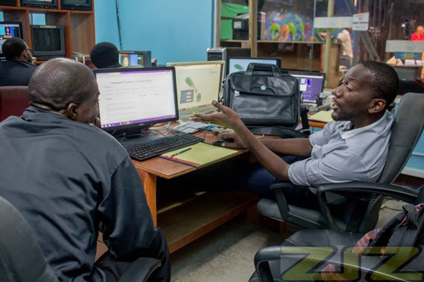

[Solution by Simulation](http://solutionbysimulation.com/2015/02/calling-the-election-in-st-kitts/ "Solution by Simulation") and I provided live election updates for the recently concluded St. Kitts & Nevis General Elections.  We were hosted by [ZIZ](http://zizonline.com/ "ZIZ") - the National Broadcasting Corporation.

Their election desk used the analytics and mapping solution we built for broadcasting live results to the population. ZIZ is the official broadcaster of election results, so they got it from the supervisor of the elections first.

\[caption id="attachment\_75" align="aligncenter" width="720"\] Joshua Browne and Irwin Williams at the ZIZ studio\[/caption\]

We landed the morning of elections day - Monday 16th February (2015) and went to the news station shortly thereafter.  After making adjustments for television presentation, we spent the night, getting polling station results, and fitting that into leading-data for constituencies, and prediction for results.

There was some [controversy](http://www.antillean.org/st-kitts-democracy-issues-245/ "controversy") with the pace of reporting, but it was a really good learning experience for the whole team.
