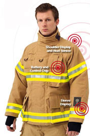

Recently, I represented Teleios at a Microsoft Trinidad Event: "Innovating your Business with Microsoft's Cloud".

I presented on the Internet of Things, together with Darryl Ramdin. I spoke in general about the Internet of Things, providing definitions and context. Darryl followed up with real world examples and case studies from Microsoft.

The Internet of Things is a global phenomenon, and I wanted to bring that sense to the participants in the room, who before this may have only been exposed to IoT as a buzzword.

According to a [2016 study from Evans Data Corp](http://www.evansdata.com/reports/viewRelease.php?reportID=38), APAC and North American developers are most likely to engage in IoT:

For the crowd in the room, that meant our region is definitely on track to feature more and more of these projects. Going further, IoT is expected to hit mainstream by 2020, [with 25B connected devices projected](http://www.gartner.com/newsroom/id/2905717).

_So, what is IoT?_

I've been using the "connecting everyday devices to the Internet" as a starting point for a long time. However, in talking with Darryl, he shared with me a simple, yet powerful set of points that are meaningful. The Internet of Things can be seen as the set of technologies that feature "things", data, connectivity & analysis. Things here, being sensors, smart devices & other points of input.  Connectivity speaks to how that Data is communicated and analysis - finding meaning in the mass of readings.

Consumers tend to see this as remote management of their devices, including thermostats, home security systems and automobiles.  And the more they see, the more they want. Connected cameras, thermostats, door locks and other appliances are among the expected popular items, [according to this study](https://www.icontrol.com/blog/2015-state-of-the-smart-home-report/).

In our seminar though, we had representation from Manufacturing, Transport, Oil & Gas and Government Administration.  They expressed interest primarily in a range of Asset Tracking situations, as well as Document Management.  A Cisco [report](http://www.cisco.com/c/dam/en_us/about/ac79/docs/innov/IoE_Economy.pdf) on IoT in the Enterprise concluded that  Asset utilization could be a $2.5 trillion component of the IoT pie, overall expected to be in the region of $14.4 trillion in 2022.

At the moment, one of the things that is jumping out at me is that many, many firms can benefit from considering and implementing IoT solutions. While waiting to present I met someone from the Trinidad and Tobago Fire Service, stationed in Tobago.  Of course, some quick searching pointed out that there is in fact an innovative use of Smart Textiles in that space - the Firefighter jacket or Turnout Gear in professional speak, with integrated **Thermal Sensor Technology** (TST) directly into the fabric.

So that while there has been moves [since the 80s](http://globeturnoutgear.com/education/standards-and-testing/thermal-protective-performance-tpp) to ensure suits are able to stand the heat, now, fire fighters can be more proactively informed about the nature of the danger they are in.

This can help fire fighters [know when the temperature](http://www.talk2myshirt.com/blog/archives/390) has become to hot for them to stay in those conditions any longer.

 

 

 

All this pointing to the understanding that there are great moves happening in the IoT space and as we've shown with the [Teleios Code Jam](http://www.teleioscodejam.com/), the barriers to entry are getting lower and lower, as university students continue to present compelling solutions in this space.
