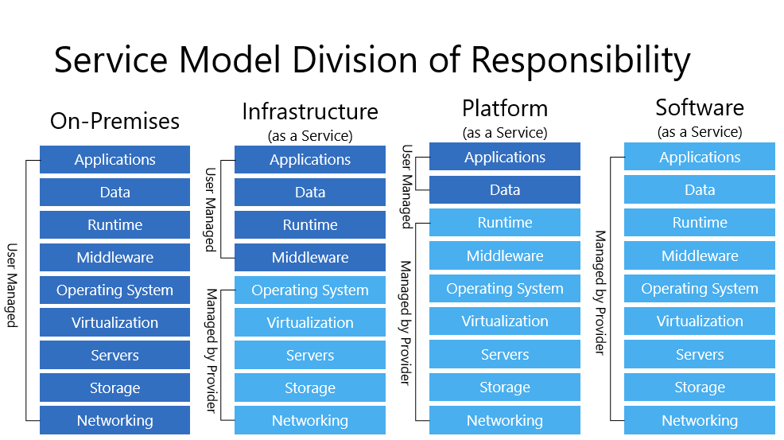
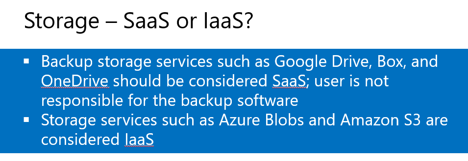

In Cloud Technologies class today, we used both the [course outline](https://docs.google.com/document/d/1bTKoJhKZi-W_uQowa8OS4iLsICPgvcl-n6P-sszapdE/edit?usp=sharing) and [the notes](https://github.com/irwinwilliams/computerscience/tree/master/Complimentary%20Course%20Content/Module1/Lessons) from MSFTImagine's Github repo to talk through the differences in service offering.

I used the canonical service model responsibility chart to start the conversation off.

\[caption id="attachment\_556" align="alignnone" width="986"\] Service Model Division of Responsibility, via [MSFTImagine](https://github.com/irwinwilliams/computerscience/tree/master/Complimentary%20Course%20Content/Module1/Lessons) on Github.\[/caption\]

It's fairly straightforward to talk to these divisions, of course. I often use it to drive home the NIST [2011 definition](https://www.nist.gov/news-events/news/2011/10/final-version-nist-cloud-computing-definition-published) of cloud services. With emphasis on the service delivery models.

In today's presentation, one of the things that jumped out at me was the slide that provided a distinction between SaaS Cloud Storage and IaaS.

\[caption id="attachment\_566" align="alignnone" width="955"\] SaaS or IaaS, via [MSFTImagine](https://github.com/irwinwilliams/computerscience/tree/master/Complimentary%20Course%20Content/Module1/Lessons) on Github.\[/caption\]

Finally, when talking about the ever versatile Salesforce, and how its PaaS solution works out it reminded me of the Online Accommodation Student Information System (OASIS :) ) that I had built when I was in undergrad.

I'd built OASIS as a commission for the Office of Student Advisory Services. It was a tool to help off-campus students more easily find accommodation. Prior to OASIS all the information was a notebook in an office. It was built before I learnt about the utility-based computing of cloud. I'm thinking about using that as the basis of an exploration of the architectural changes need to move an old service to the cloud.

Hopefully, I'll be able to revisit it when we touch on Cloud Design Patterns.
