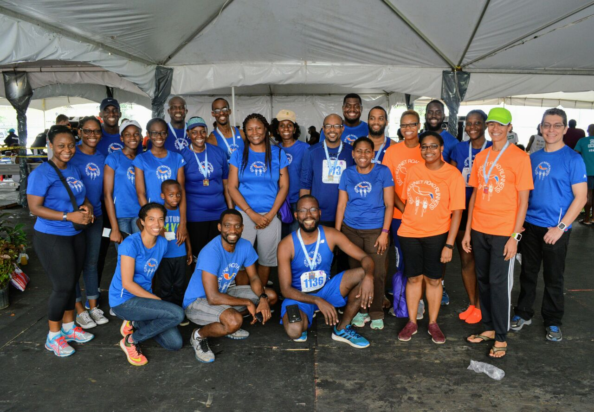

Just completed the 2017 edition of the University of the West Indies' International [Half Marathon](http://sta.uwi.edu/spec/marathon/).

This was a brutal run in beautiful weather. The "race" starts at 5:30 am. Last week, stormy weather was on the cards. Some might believe running in the rain is a joy, but not for 13.1 miles. Thankfully, it was very cool for the duration of my run, no sun, no rain & a light breeze.

I often start off too quickly. The PhillyNet Half Marathon training started just before the middle of the year in earnest and through a series of long and short runs, strength work and other training, the team and I got in to racing shape. 11 of us ran the race, but more than double that at times trained with the team. We had many supporters, on the course and online. But anyway, I still start off too quickly. I may have some overall race pace that I want to maintain, and invariably, my first mile is off. That's where Endomondo comes in. I start it up on my phone, and at the end of mile 1, the Endomondo Lady announces, "Aye! Stop! You're going too fast, slow down!". OK, no, she doesn't do that. Instead, she announces that I'm running at 8-something a mile or some such and I know, "Oh, if I want to finish this race in a decent overall time, I have to slow down". Today, E. Lady was quiet. I got to mile 1 and heard nothing.

Immediately disappointed, I expected it was because even though I started it at the start of the race, bad GPS or some android-y thing had thrown things off. Since a mile had passed, I was not interested in getting it going if it was off. Anyway, I felt good. I just didn't know what time it was.

I would have run the entire race time-blind, if not for this year's UWI half innovation: race pacers. Either they were provided by UWI or some other club, but they were golden. Well, not literally. I saw a 1:50:00 pacer and a 2:00:00 one. Keeping up with them would essentially give you a race result of their stated times. The 1:50:00 one flew past me after mile 2. And since I hadn't seen the 2:00:00 for the first half, I judged to be between those finishing times. But having a pacer in no wise means having the power to finish at those times. So, I had to be careful.

With no E. Lady in my ear, improvisation became necessary. Since there were so many runners, finding and keeping pace with someone on the course became a fun, mini-game. At first there was the lady from [+One a Week](http://oneaweek.evolutiontiming.net/), I kept up with her for about half a mile. Two ladies overtook me and ran on that spot I started to like - the exact middle of the road on the white line. So, I overtook them to reclaim my land. That cat and mouse lasted for a mile and then they bested me.

Coming up to mile 4, there was loud music. I liked it, then it got too loud, then I liked it again. The DJ seemed very proud to remix "Full Extreme" into "We Runnin Still".

> "The buildings,
> 
> Could fall down,
> 
> We running still... we runnin still.
> 
> The treasury,
> 
> Could fall down,
> 
> We running still... we runnin still..."

I mean, it sorta worked. Something about the loud music added some energy to my run that I intended to use later.

I met up with someone from TT Road Runners and that partnership lasted probably two miles. We got up to the turn together. Mind you, these aren't announced things. It's just that as a runner, you realize someone is next to you, they're keeping pace and either you increase yours to leave them in your dust or you chill and maybe see how far it goes.

She eventually outran me and I was alone. The 2:00:00 pacer passed me at mile 7 or so, but then, my family, immediate and extended was there at mile 8, being raucous and extremely encouraging. Sophie, my 10-month-old, even deigned to give me a look and a small smile. All this probably being a bit much for her thankyouverymuch. I knew the pressure miles for me would be between mile 10 and 11 and a little after. By the time I got past the Eddie Hart ground, which is about a quarter mile after the 10 mile mark, I got into my head that I needed something to distract me. So, I started to count. I just picked a number and counted up to it.

Somewhere between 300 and 400 "counts" I met up TT Road Runner lady. She seemed to be having a hard time. So, I tried to return the favor. Shouting out encouragement to other runners gives me a slight jolt myself. I yelled things like "keep it up", "this is the hardest one" and such. I don't know if it worked. Running is a physical thing. Not a talking thing. To a guy who passed me that I was meeting up to, I yelled some more. For some reason, I was legit feeling OK, coming in to mile 11. There's a hill up to mile 11 and another one up to mile 12.

To keep pace up the mile 12 hill, I pulled out and old trick: [Father Abraham](http://vibes.irwinwilliams.com/2007/11/run-yuh-own-race.html).  I just sang the song and sort of performed the steps. Way, it's a long song. It worked, though. All the while, I kept 2:00:00 in sight. By mile 12, I returned to counting.  This time, down from 900. 900 because it would take me about 10 minutes to get to 1. I saw my wife, Sophie and #TeamPhillyNetSupporters again. Again providing a burst of joy.

I settled in my mind, a few weeks before the race that the half marathon is a 12.75 mile jog and a quarter mile race. I only really care to finish ahead of people at the very last piece of the run. So that's what I did. I essentially pelted through the straightaway and for my effort, copped a really good time.

Going in to the run, I was expecting and said as much to do the race in 2:10:00 or 2:15:00. This result was very surprising and I think the combination of decent training with PhillyNet and random race partnerships helped me discover some new things about running.

\[caption id="attachment\_769" align="alignnone" width="1280"\] PhillyNet Runners and Supporters\[/caption\]

PS: Oh, as it turns out, [Endomondo was fine](https://www.endomondo.com/users/9934184/workouts/1024872880). I had my audio settings too low, so she was talking, just at a whisper.
