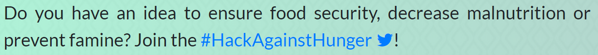

Last weekend, I attended the Trinidad and Tobago leg of the WSIS' Hack Against Hunger event.

https://twitter.com/iStarr/status/964860536184811521

I was talking with Dr. Bernard about a new Teleios Code Jam initiative and she let me know what was going on at the weekend.

So, I went on Saturday to hear what it was about and wondered if I'd have any time to build something simple.  The hackathon had a really nice premise:

Hackathons tend to be pressure cookers, so I wasn't game to spend all night and day building something. Largely because my wife and child would not have been impressed, but I could have carved out some space to put an idea together.

"Carving out some space" really meant getting three hours of sleep while stumbling around datasets, doing the dishes and taking care of baby. An good solution came together, though.

I tackled nutrition, using my own experiences with trying to find the best food for my family. Best of course being relative. One might think that means most expensive, when really, it can mean, most appropriate. For example, our pediatrician told us, lay off the flour-based spaghetti and dive in to more ground provisions for our baby girl. That stuff can be pretty cheap in the local market.

Thus, I spent my time hacking together a virtual assistant that will help with finding out both the locally produced foods and their nutritional content. I called the bot Miss Mary. Largely because the old lady in the market that I ask questions like "what's this thing?" and "how do you know that pepper's good?" 1. It was cassava yam and 2. Because she ate it raw. I don't know her name, but she reminds me of a shopkeeper in a place I used to live, who was called Miss Mary.

Presentation time, I didn't have one, so I put [this together](https://docs.google.com/presentation/d/1Rl5fZVNU1xA57JjYnGNpWbSlrgLaZhMcBLQsozU5LII/edit#slide=id.g31067e1c0a_0_79) to help tell the story.

I wasn't able to stay for the remaining presentations, but I was told they were really good. I'm looking forward to hear more of what was built! Ultimately, the first prize went to Sterling & Keshav. For their troubles, they'll be headed to Geneva later in March to compete once more.

All the best, guys! :) #KeepHacking

PS: I'll release a version of Miss Mary a bit later on, I was excited to share the story! :)
