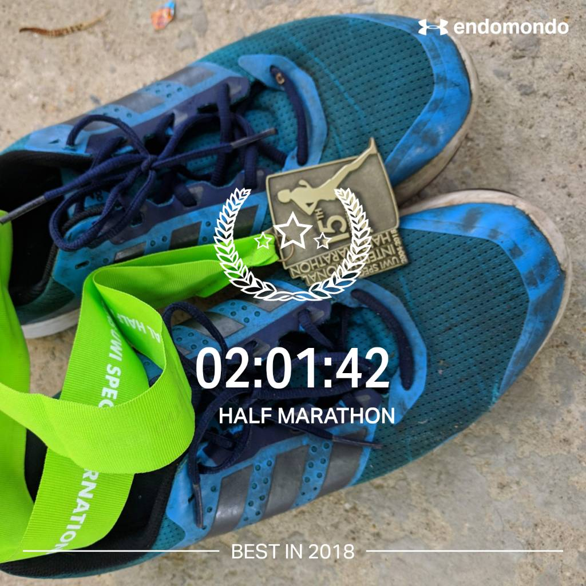

In my running group I declared I was going to do this year's UWI Half Marathon in 11:00 minute miles. My friend roundly berated me for aiming so slow, us having run together and him just knowing I can do a bit better.

Nothing's wrong with that time if that's where your training and skill have taken you. But he was like, you do the thing at 9:00 last year and reach 11:00 this year?! LOL, he was right. But I had a bag of excuses, less time to train, distractions, tiredness.

The man said don't come and talk to me if you run this thing at no 11.

I had a fairly safe race planned. Because truly, my training wasn't where I wanted it this year (also, lol, this is usually the case). But I planned to play some nice chill music, run at 10:30 for the first half and then try and maintain an even 10 on the way back down.

I started off too quickly.

By the time I got to my first half-mile, with my chill music playing, Endomondo told me I was at 8:something a mile. :) Not good - based on my safe outlook on the race. A little after the mile, I realized I was not going to play this according to plan at all.

\[caption id="" align="alignnone" width="1280"\] This is just after mile 5. Me and the pacer became friends this day.\[/caption\]

I ran with the pacer. The 9:00-mile pacer. I saw him coming up with his jolly, flag self just after the first mile, I did a quick self-diagnostic check and determined I felt good at that pace and just went with it.

Pacers feel like the best thing innovation to the UWI half in a long time! They aren't there to win, not there to get a medal, just there to be a beacon, and not even a silent one. Dude was hailing out people he knew, encouraging his growing following and just being literally a living flag of hope.

So, I ran with the pacer all the way to the half-mark. He had to turn off for a bit and I did not sustain my 9:00. I ran too fast, I ran too slow, but I had enough gas and my new music kicked in at the right time. I listened to both recent hip hop albums from Congress Music Factory that seem to be perfect for running as well as spiritual sustenance.

But all that delight started to wane at mile 10. It became a familiar slog as the sun came up, my muscles' tiredness became more vocal and essentially, I started to lose focus. My pacer buddy came back, like a good Pied Piper with his merry crew. But this time, I couldn't answer his call.

By mile 11, I did get to that 11:00-mile pace, with a single goal: keep running. Or jogging. But not walking. I knew from experience that the walk would feel REALLY GOOD, but do a lot of damage to my momentum. So I kept running and by mile 12 got the surge I needed to finish the race.

I ended up having a really decent average pace of 9:17-mile. Not a bad result.

PS:

At the end of the race in the runner's tent, I was waiting for a massage. Next to me sat this "elderly" dude. He told me he's been running for longer than I've been alive. His race time? 1:37:00.
