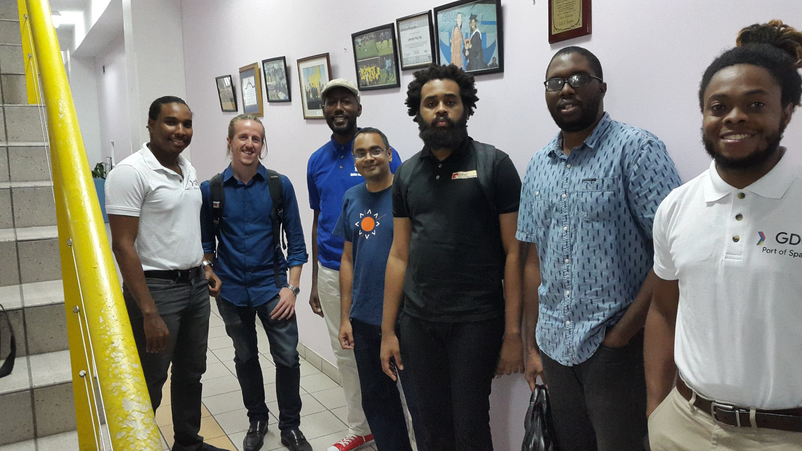
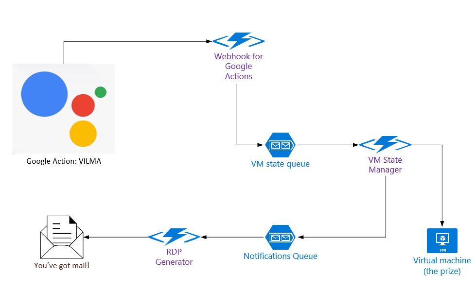
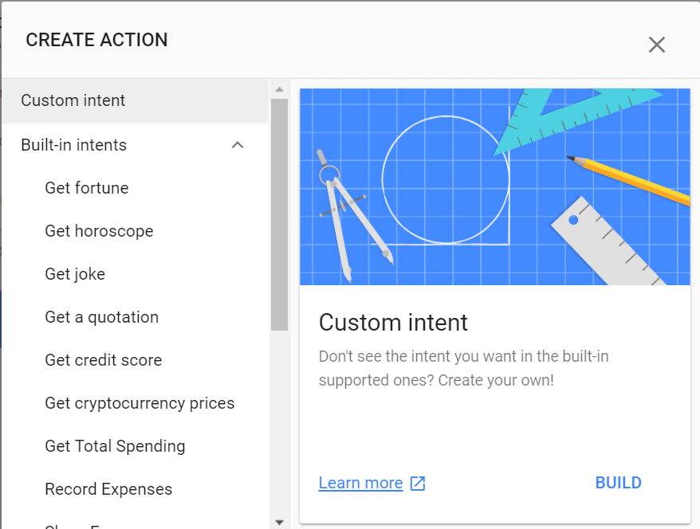

Sometimes, I get home and just wish I could say to my virtual machine in the cloud, "magico presto, turn on!" and it's on and ready for me to remote into and do things. I wanted to do things to make that happen, but time and procrastination happens to many. Thankfully, there was an upcoming developer gathering that I used as the catalyst to actually build a system that would work, almost like magic.

So, last [Sunday](https://www.meetup.com/GDG-Port-of-Spain/events/254464979/), the Port of Spain chapter of GDG (Google Developer Groups) held a developer event, #GDGPOS #DevFest. They reached out to the local developer community for interesting projects and I responded with a proposal to build something that would work in the way I described.

\[caption id="attachment\_848" align="alignnone" width="2048"\] GDGPOS Presenters\[/caption\]

My proposal got accepted and I spent a few weeks building out the idea. My whole solution involved using my Google mini to turn my virtual machine on or off.

To do that, I created a [Google Action](https://www.youtube.com/watch?v=1MhYTvHSv8U) on the Google Actions [console](http://console.actions.google.com/). I had played around with Actions before, but this would be different. I have been making most of my conversational agents using Microsoft's [Bot Framework](https://dev.botframework.com/)[Bot Framework](https://dev.botframework.com/), so a lot of the concepts were familiar to me, from things like Intents, to Utterances and even the use of webhooks. For this action, I largely had to focus on just one Intent - the one that would hear a command for a VM state change and execute. Overall, the system would look like this:

- Creating the action

So, I created this custom Intent that took me to Dialogflow, Google's interactive tool for building conversational interfaces. There, I created a custom intent, ChangeVMState.

ChangeVMState would receive messages and figure out if to turn a VM on or off. The messages could be in a range of formats like:

- turn on/off
- power on/off
- shutdown/start up the vm

They would resolve to the ChangeVMState intent. All messages sent to ChangeVMState was then forwarded to my webhook. I deployed the webhook as a function in Azure.

The code to execute the functions is pretty straightforward. One function receives the request and queues it on an Azure Storage Queue.  Azure functions provides a really simple infrastructure for doing just that. 

I mean, this is the whole method: 

https://gist.github.com/irwinwilliams/64d3d418ae530e3d4cd9d30add7e7afb

The item being put on the queue - the desired VM state - is just a variable being set. 

Another function in Azure will then take up the values in the queue and will start or stop the VM based on state. Again, a pretty simple bit of code. 

https://gist.github.com/irwinwilliams/cc639c2984b0b11a0cc11aaf28801e80

I'm using the Azure Fluent Management SDK to start/stop a VM

So, finally, after the VM is put into the desired state, an email is sent either saying the VM is off or that it's on and an RDP file is included. Ideally, I wanted to have the Google Assistant I was using notify me when the VM got up and running, but I just [couldn't get push notifications](https://stackoverflow.com/questions/53449381/403-on-google-action-push-notification-request) working - which is why I ended up with email. 

Thus,  I ended up with a Google Action, that I eventually called VILMA Agent (at first, I was calling it Shelly-Ann).  I could say to my Google Mini, "OK, Google, tell VILMA Agent, turn on" and I'd get an email with an RDP file.

The code for the functions part of VILMA is up here on [GitHub](https://github.com/irwinwilliams/VILMA).
