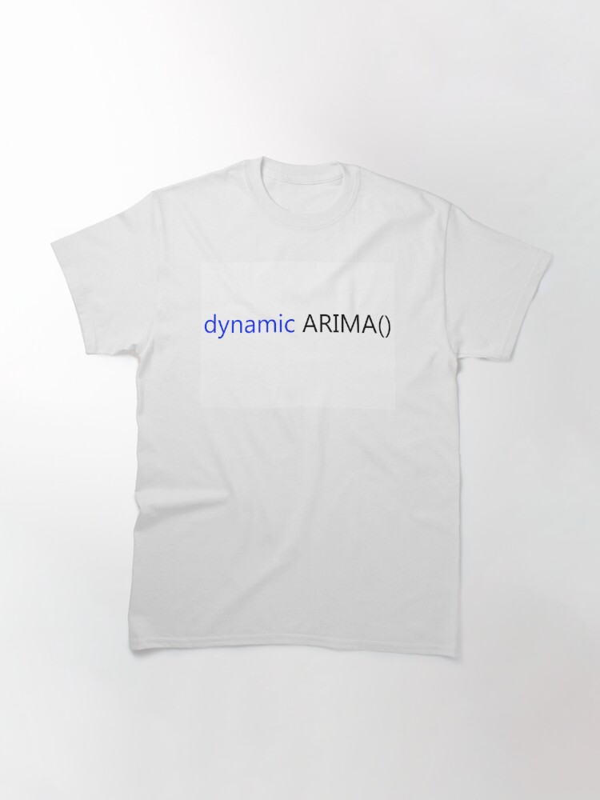

I like how WordPress' default on these blog posts is "tell your story". LOL.

[Recently](https://irwinium.wordpress.com/2019/01/13/conquering-complexity-with-a-map/), I described wanting to use Azure App Insights for dependency tracking. I started by looking at documentation on it. I ended up using [this](https://docs.microsoft.com/en-us/azure/azure-monitor/app/api-custom-events-metrics#trackdependency), along with this [video](https://www.youtube.com/watch?v=TA3g28RkK-8).

As I started looking into the first place to drop in dependency notification, which was where I create my Azure Container Instance. The tutorial's code suggested dropping this fragment into a finally around where the dependency was, like so:

From: https://docs.microsoft.com/en-us/azure/azure-monitor/app/api-custom-events-metrics#trackdependency

Then I found myself wondering if for the dependencies I was going to track, wouldn't a C# attribute be really good. Then I fell down a rabbit hole of [when to create attributes](https://stackoverflow.com/questions/3673941/what-is-the-purpose-of-attributes-in-c).

And then I emerged out of that hole, attribute-less.

So, after I applied guidance from the Application Insights document, I colored my external operations with track dependency calls and ended up with this image:

Azure Application Insights application map for my solution

This does what I wanted, which is to visualize the components and dependencies of my solution, with information on success/failure and duration of the calls.

I'd like to do more with this.
