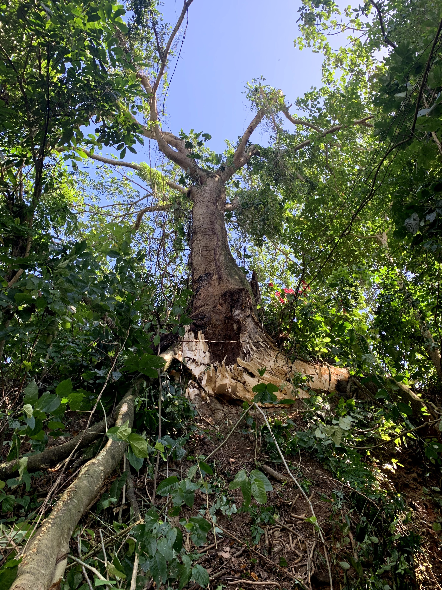
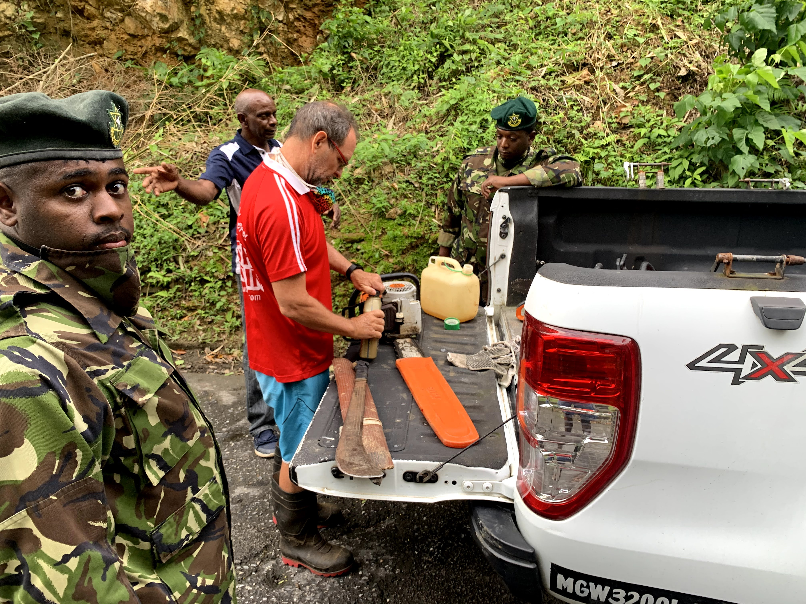

At about 5:00 am, the fans stopped spinning. And we knew there was a power outage. We rolled back to sleep in the embers of the night and thought, "oh well, they'll sort themselves out".

We were jolted out of sleep two hours later, by the loud noise of a crash down the road.

A massive tree had fallen. It made the electricity company seem far more prescient than I had ever given it credit for.

The tree that collapsed pulled down wires from two poles, caused one of them to fold over into an acute angle and pushed cords into the nearby river.

Early morning, early January disaster.

By the time I walked down to check out what was going on, with only my phone in hand, the community response was well underway.

The community seemed battle-hardened by these events. My wide-eyed, city-boy confusion melted away. A man in a van turned up with not one, not two but three chainsaws. Others turned up with rope and van man, sent for gasoline.

The army was on the scene relatively quickly too. Closed the road and essentially kept people who weren't helpful at a useful distance. Me, the kept me away.

The men of the neighbourhood started cutting and when the fire services arrived, with their coordination and support the tree was eventually moved aside.

Cars could pass once again, though of course, slowly. By the time the electricity company arrived, the road was clear enough to let them begin the repair process.

The situation reminded me about the need for [status updates from utilities](https://irwinium.wordpress.com/2020/06/29/status-utility-co-tt/). There's clearly a chain of events needed here. The community response was an amazing, welcome first step. But it seemed like a proactive neighborhood. The baton was passed to the fire services, which made the way for the team from the electricity company.

Who would tell the other service providers? I didn't see any communication utilities on the scene. Were they aware? Would they spring into action like the men with the chainsaws? This is doubtful.

Also, my family and I temporarily decamped to a place to get power, Internet and some chill. When should we go back? Again, it would be great to either check something like "**status.utility.co.tt**" to find out.

For now, I'd actually settle for an SMS or WhatsApp from the providers. To date, we've gotten none. It seems like the best response will remain that of individuals and neighbours, who proactively set up their own systems, limited as they are, until better can be done.

https://www.youtube.com/watch?v=nHjSQZZHdS4&feature=youtu.be
